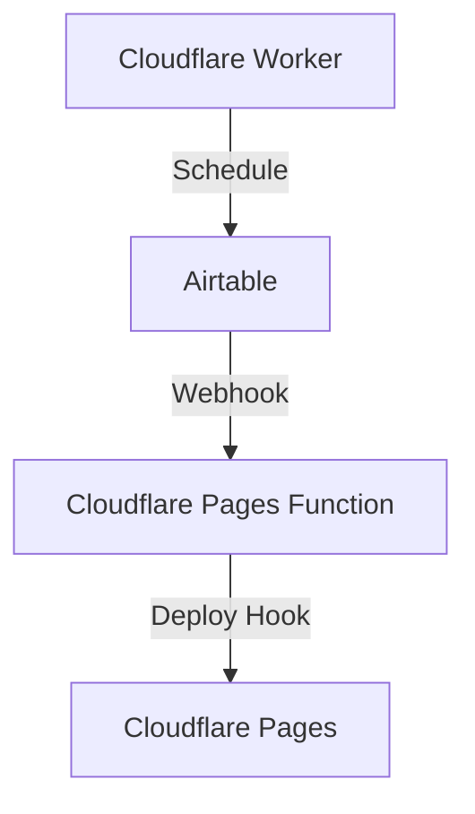

# Mini Aussiedoodle

## Development

This project uses Jekyll and Wrangler to serve the site locally. To start the development server, run the following commands:

```
bundle install
npm install
bundle exec jekyll serve --livereload
npx wrangler pages dev _site
```

Note: I should be able to improve this in the future. We need the `jekyll serve` command to complile the site and download data from airtable, but the `wrangler dev` command to build functions.

## Production

Deploying to production is done through Cloudflare Pages. To deploy, push to the `main` branch.

### Airtable Webhooks

While the site is static, some of the data comes from Airtable to allow clients to more easily update the site. To do this, we use a webhook to trigger a build when the Airtable data changes. 

There are two known limitations with this approach:

1. Airtable webhooks only trigger GET requests, so we can't send a payload directly to the Cloudflare Pages Deploy Hook.
2. Airtable webhooks expire after 7 days, so we need to manually refresh them.

In order to work around these limitations, we use a Cloudflare Worker to act as a proxy between Airtable and Cloudflare Pages. This worker listens for requests from Airtable, and then triggers the Cloudflare Pages Deploy Hook. In addition, we have a separate Cloudflare Worker that runs on a schedule to refresh the Airtable webhook.



1. Create a Cloudflare "Deploy hook" in the Cloudflare dashboard.
2. Set the `CLOUDFLARE_HOOK_ID` variable.
3. Create a new Airtable webhook that calls the "update" Cloudflare Function.
4. Create a Cloudflare Worker that hits the "refresh" Cloudflare Function on a schedule.

Use the following commands to create and audit the webhooks:

```sh
# list webhooks
source .env ; curl "https://api.airtable.com/v0/bases/${AIRTABLE_BASE_ID}/webhooks" -H "Authorization: Bearer ${AIRTABLE_ACCESS_TOKEN}"

# create webhook
# make sure to update the recordChangeScope to the correct table
source .env ; curl -X POST "https://api.airtable.com/v0/bases/${AIRTABLE_BASE_ID}/webhooks" \
-H "Authorization: Bearer ${AIRTABLE_ACCESS_TOKEN}" \
-H "Content-Type: application/json" \
--data '{
    "notificationUrl": "https://www.miniaussiedoodle.dog/update",
    "specification": {
      "options": {
        "filters": {
          "dataTypes": [
            "tableData"
          ],
          "recordChangeScope": "tblahImc8fNVCBelO"
        }
      }
    }
  }'
```